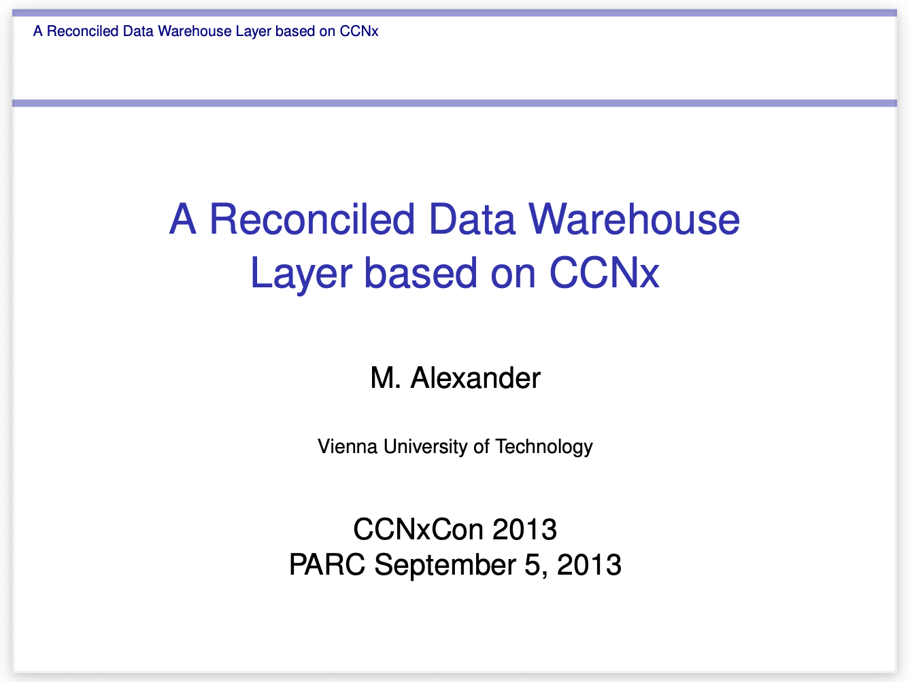

# A Reconciled Data Warehouse Layer based on CCNx

A distributed data warehousing architecture leveraging Content-Centric Networking (CCNx) for large-scale data dissemination and analytics.

## Overview

This project implements a reconciled data warehouse layer using CCNx protocol, designed to handle very large database warehousing with distributed data locality requirements. It addresses the challenge of disseminating terabyte-scale daily data loads to geographically dispersed users.

## Key Features

- **CCNx-based Architecture**: Utilizes Content-Centric Networking primitives for efficient data distribution
- **MariaDB/MySQL Integration**: Custom storage engine implementation based on CSV engine
- **Distributed Operations**: Supports geographically dispersed data warehousing with explicit concurrency control
- **Large-Scale Data Handling**: Optimized for Earth Observation and scientific datasets (100s MB/day ETL rates)

## Documentation

**[Presentation (PDF)](./ccdbdocs/ccdbParc_released.pdf)**

*Presented at CCNxCon 2013, PARC*

## Components

- Modified MariaDB/MySQL storage engine with CCNx support
- Apache Zookeeper for global state management
- Custom SQL CCDB commands
- Hierarchical namespace mapping to CCNx URI schema

## Use Cases

- Earth Observation data dissemination
- Climate model data distribution (CMIP5)
- Large-scale analytics workloads requiring data locality

## Author

M. Alexander, Vienna University of Technology

